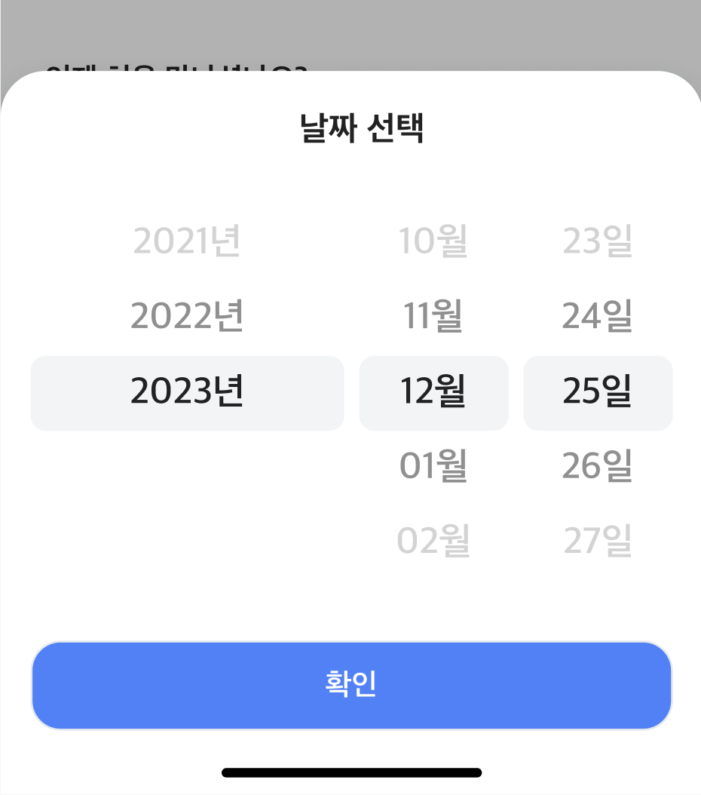

# react-ios-style-picker

`react-ios-style-picker` is a highly customizable, easy-to-use React component library designed to mimic the native iOS picker interface. This library provides an accessible way to integrate picker functionality into your React applications. The components are built with flexibility in mind, allowing for extensive customization in terms of appearance and behavior.

The library includes two main components:

- **Picker**: Enables users to select options from a scrollable list, which can be customized with various styles and callback functions.
- **BottomSheet**: A versatile component that slides up from the bottom of the screen, perfect for housing pickers, menus, or other content in a modal overlay.

Whether you're building a mobile-first design or adding mobile-friendly elements to a responsive web application, `react-ios-style-picker` provides the tools you need to incorporate sleek, intuitive selection interfaces.



## Key Features

- **iOS-like Interface**: Provides a user experience similar to the native iOS picker, making it ideal for creating consistent and familiar interfaces across web and mobile platforms.
- **Customizable Appearance**: Offers extensive styling options to match the picker and bottom sheet components with your application's theme.
- **Flexible Functionality**: Supports a variety of use cases from simple date pickers to more complex custom selector interfaces.
- **Accessibility Focused**: Designed with accessibility in mind with ARIA attributes and keyboard support.
- **TypeScript Support**: Fully typed with TypeScript for better development experience.
- **Tree-shakeable**: Optimized for modern bundlers with proper side effects configuration.

## Installation

To use these components in your project, you need to install the library via npm or yarn:

```bash
npm install react-ios-style-picker
```

or

```bash
yarn add react-ios-style-picker
```

## Usage

### Picker

The Picker component allows users to select an item from a scrollable list. It is customizable with styles and callback functions.

#### Props

| Prop | Type | Default | Description |
|------|------|---------|-------------|
| `list` | `(string \| number)[]` | **required** | Array of items to display in the picker |
| `itemHeight` | `number` | `50` | Height of each item in pixels |
| `initialSelected` | `string \| number` | - | Initially selected item |
| `onSelectedChange` | `(selected: string \| number) => void` | - | Callback function called when a new item is selected |
| `itemClassName` | `string` | - | Additional CSS class for each item |
| `itemStyle` | `React.CSSProperties` | - | Inline styles for each item |
| `className` | `string` | - | CSS class for the wrapper div |
| `style` | `React.CSSProperties` | - | Inline styles for the wrapper div |
| `listClassName` | `string` | - | CSS class for the list element |
| `listStyle` | `React.CSSProperties` | - | Inline styles for the list element |
| `showGradientMask` | `boolean` | `true` | Show gradient mask at top and bottom |
| `showCenterIndicator` | `boolean` | `true` | Show center selection indicator |
| `theme` | `"light" \| "dark" \| "auto"` | `"auto"` | Theme mode |

#### Basic Example

```jsx
import { Picker } from "react-ios-style-picker";

function App() {
  const [selected, setSelected] = React.useState("Option 2");

  return (
    <Picker
      list={["Option 1", "Option 2", "Option 3"]}
      itemHeight={40}
      initialSelected={selected}
      onSelectedChange={(value) => {
        console.log(`Selected: ${value}`);
        setSelected(value);
      }}
    />
  );
}
```

#### TypeScript Example

```tsx
import { Picker, ScrollPickerProps } from "react-ios-style-picker";

function App() {
  const options: ScrollPickerProps['list'] = ["Apple", "Banana", "Cherry"];
  const [selected, setSelected] = React.useState<string | number>("Banana");

  return (
    <Picker
      list={options}
      itemHeight={50}
      initialSelected={selected}
      onSelectedChange={setSelected}
      theme="dark"
      showGradientMask={true}
      showCenterIndicator={true}
    />
  );
}
```

#### Advanced Styling Example

```jsx
import { Picker } from "react-ios-style-picker";

function StyledPicker() {
  return (
    <Picker
      list={Array.from({ length: 100 }, (_, i) => i + 1)}
      itemHeight={60}
      className="my-picker-wrapper"
      listClassName="my-custom-list"
      itemClassName="my-custom-item"
      itemStyle={{
        fontSize: "18px",
        fontWeight: "500",
        color: "#333",
      }}
      style={{
        width: "200px",
        margin: "0 auto",
      }}
    />
  );
}
```

### BottomSheet

The BottomSheet component is used to display content in a sliding panel from the bottom. It is ideal for modal views.

#### Props

| Prop | Type | Default | Description |
|------|------|---------|-------------|
| `children` | `React.ReactNode \| React.ReactNode[]` | **required** | Content to display inside the BottomSheet |
| `isOpen` | `boolean` | **required** | Whether the BottomSheet is visible |
| `onClose` | `() => void` | **required** | Function to call when the BottomSheet needs to be closed |
| `className` | `string` | `""` | Additional CSS class for the overlay |
| `style` | `React.CSSProperties` | `{}` | Inline styles for the BottomSheet content |
| `button` | `React.ReactNode` | - | Optional button to display in the BottomSheet |
| `theme` | `"light" \| "dark" \| "auto"` | `"auto"` | Theme mode |

#### Basic Example

```jsx
import { BottomSheet } from "react-ios-style-picker";

function App() {
  const [isOpen, setIsOpen] = React.useState(false);

  return (
    <>
      <button onClick={() => setIsOpen(true)}>Open BottomSheet</button>
      <BottomSheet
        isOpen={isOpen}
        onClose={() => setIsOpen(false)}
      >
        <div>Content goes here</div>
      </BottomSheet>
    </>
  );
}
```

#### TypeScript Example

```tsx
import { BottomSheet, BottomSheetProps } from "react-ios-style-picker";

function App() {
  const [isOpen, setIsOpen] = React.useState<boolean>(false);

  const handleClose: BottomSheetProps['onClose'] = () => {
    setIsOpen(false);
  };

  return (
    <>
      <button onClick={() => setIsOpen(true)}>Open BottomSheet</button>
      <BottomSheet
        isOpen={isOpen}
        onClose={handleClose}
        theme="light"
      >
        <h2>Title</h2>
        <p>Your content here</p>
      </BottomSheet>
    </>
  );
}
```

#### Combined Example with Picker

```jsx
import { Picker, BottomSheet } from "react-ios-style-picker";

function DatePickerSheet() {
  const [isOpen, setIsOpen] = React.useState(false);
  const [selectedYear, setSelectedYear] = React.useState(2024);

  const years = Array.from({ length: 50 }, (_, i) => 2000 + i);

  return (
    <>
      <button onClick={() => setIsOpen(true)}>
        Select Year: {selectedYear}
      </button>
      
      <BottomSheet
        isOpen={isOpen}
        onClose={() => setIsOpen(false)}
        button={
          <button onClick={() => setIsOpen(false)}>Done</button>
        }
      >
        <Picker
          list={years}
          initialSelected={selectedYear}
          onSelectedChange={setSelectedYear}
          itemHeight={50}
        />
      </BottomSheet>
    </>
  );
}
```

## Accessibility

The components are built with accessibility in mind:

- **Picker**: Includes ARIA attributes (`role="listbox"`, `aria-label`, `aria-activedescendant`) for screen readers
- **BottomSheet**: 
  - Supports ESC key to close
  - Includes `role="dialog"` and `aria-modal="true"`
  - Manages focus automatically

## Styling

The library includes default CSS styles that are automatically imported. The CSS is modular and can be customized using:

1. **CSS Classes**: Add custom classes via `className`, `listClassName`, `itemClassName` props
2. **Inline Styles**: Use `style`, `listStyle`, `itemStyle` props
3. **Theme Mode**: Use `theme` prop to switch between light/dark modes
4. **CSS Variables**: Override CSS custom properties in your own stylesheet

## Browser Support

- Chrome (latest)
- Firefox (latest)
- Safari (latest)
- Edge (latest)

## License

MIT © [reeseo3o](https://github.com/reeseo3o)

## Contributing

Contributions are welcome! Please feel free to submit a Pull Request.

## Issues

If you find a bug or have a feature request, please file an issue at [GitHub Issues](https://github.com/reeseo3o/react-ios-style-picker/issues).
